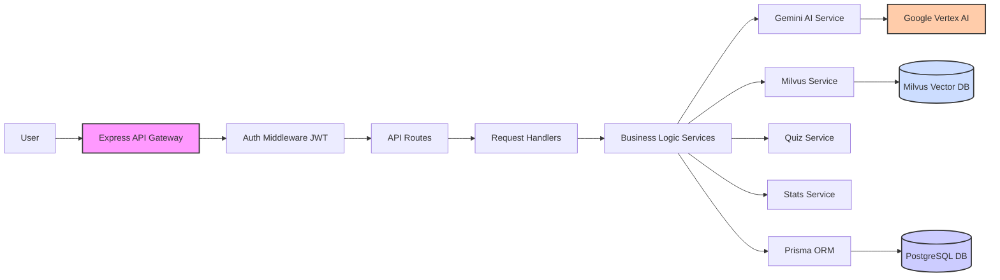

# Learnability Backend API: Technical Documentation ⚙️

[](https://www.gnu.org/licenses/gpl-3.0)

**Note:** For the overall project vision, goals, and user features, please refer to the main [**Project README**](https://github.com/0xteamMuffin/LearnAbility). This document covers the backend implementation details.

---

## Table of Contents

*   [✨ Core Backend Functionality](#✨-core-backend-functionality)
*   [🏗️ Architecture](#🏗️-architecture)
*   [💻 Technology Stack](#💻-technology-stack)
*   [🔌 API Documentation](#🔌-api-documentation)
*   [🚀 Getting Started](#🚀-getting-started)
    *   [Prerequisites](#prerequisites)
    *   [Setup with Docker (Recommended)](#setup-with-docker-recommended)
    *   [Manual Setup](#manual-setup)
    *   [Running the App](#running-the-app)
*   [📁 Project Structure](#📁-project-structure)
*   [📜 License](#📜-license)

---

## ✨ Core Backend Functionality

This API serves as the engine for Learnability, providing:
*   **AI Content Services:** Uses Google Gemini for generating lessons, quizzes, and summaries from user-uploaded materials.
*   **Personalization:** Tracks user progress and provides a tailored content feed.
*   **Vector Search:** Integrates Milvus for semantic search within learning materials.
*   **User & Content Management:** Handles authentication, user data, subjects, materials, quizzes, etc.
*   **Analytics:** Provides data on quiz performance.

---

## 🏗️ Architecture

The backend uses a modular Node.js/Express structure:


*   Requests flow through authentication and routing to specific service logic interacting with databases and AI APIs.

---

## 💻 Technology Stack

*   **Language:** TypeScript
*   **Framework:** Node.js & Express.js
*   **ORM:** Prisma
*   **Databases:** PostgreSQL (Relational), Milvus (Vector)
*   **Validation:** Zod
*   **Auth:** JWT
*   **AI:** Google Vertex AI (Gemini)
*   **Containerization:** Docker & Docker Compose

---

## 🔌 API Documentation

The API provides RESTful endpoints for platform features.

### Endpoint Groups Overview

*   `/api/v1/auth`: User management (register, login, profile).
*   `/api/v1/stats`: Learning progress tracking.
*   `/api/v1/pyos`: Subject/material management, lesson generation.
*   `/api/v1/quiz`: Quiz management and attempts.
*   `/api/v1/analytics`: Quiz performance data.
*   `/api/v1/query`: Semantic search.
*   `/api/v1/feed`: Personalized content feed.

_(For detailed request/response structures, please refer to the route handlers and Zod schemas in the `src/` directory.)_

---

## 🚀 Getting Started

### Prerequisites

*   Node.js (LTS - v18/v20+)
*   npm / yarn
*   Docker & Docker Compose
*   Git

### Setup with Docker (Recommended) 👍

1.  **Clone this repo:** `git clone https://github.com/0xteamMuffin/LearnAbility-backend.git` & `cd LearnAbility-backend`
2.  **Env File:** Copy `.env.example` to `.env` and fill in your secrets (`JWT_SECRET`, `GOOGLE_CLOUD_PROJECT`, etc.). Ensure `DATABASE_URL` points to the Docker Postgres service name (default: `postgres`).
3.  **Start Databases:**
    ```bash
    # Start Postgres
    docker-compose -f docker/docker-compose-postgres/docker-compose.yml up -d
    # Start Milvus
    docker-compose -f docker/docker-compose-vectordb/docker-compose.yml up -d
    ```
4.  **Install API Deps:** `npm install`
5.  **DB Migrations:** `npx prisma migrate dev --name init`
6.  **Run API:** See below.

### Manual Setup 🧑‍💻

1.  **Clone & Install:** As above.
2.  **Databases:** Ensure PostgreSQL & Milvus are running and accessible.
3.  **Env File:** Copy `.env.example` to `.env` and update `DATABASE_URL` etc. for your setup.
4.  **DB Migrations:** `npx prisma migrate dev --name init`

### Running the App

```bash
npm run dev
```
The API will typically be available at `http://localhost:3000`.

---

## 📁 Project Structure

```
.
├── docker/         # Docker configs
├── prisma/         # DB schema & migrations
├── src/            # Source Code
│   ├── db/         # Prisma client
│   ├── handler/    # Route handlers
│   ├── middleware/ # Express middleware
│   ├── routes/     # API routes
│   ├── schemas/    # Zod validation schemas
│   ├── services/   # Business logic
│   └── index.ts    # App entry point
├── .env.example
├── package.json
└── tsconfig.json
```

---

## 📜 License

Licensed under the **GNU General Public License v3.0**.
